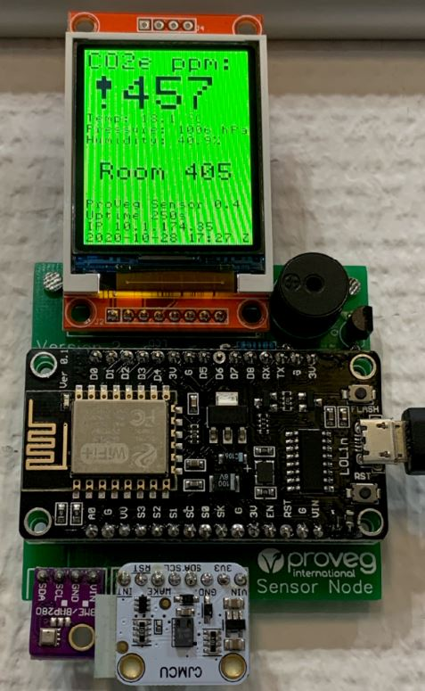

# ProVeg Sensor Node

The ProVeg Sensor Node is a network connected device to measure the quality of air in a room,
notify the users of the room of the air quality (CO2e ppm number and traffic light color on the screen,
multi-tiered warning sounds if the air is too bad), make the measurements accessible to
and show information from the Internet (like the names of the users scheduled for that room for the day).

It can also be used for a subset of its features, like a connected desk reservation display
without the air measurement function.

It consists of a PCB with readly available modules and scripts written in MicroPython.
Please see the respective folders [Hardware](Hardware) and [Software](Software).

